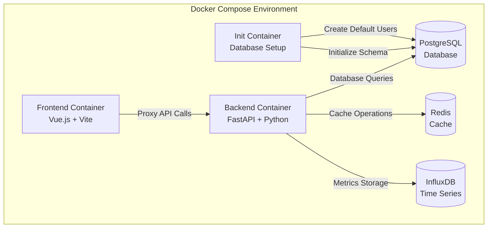
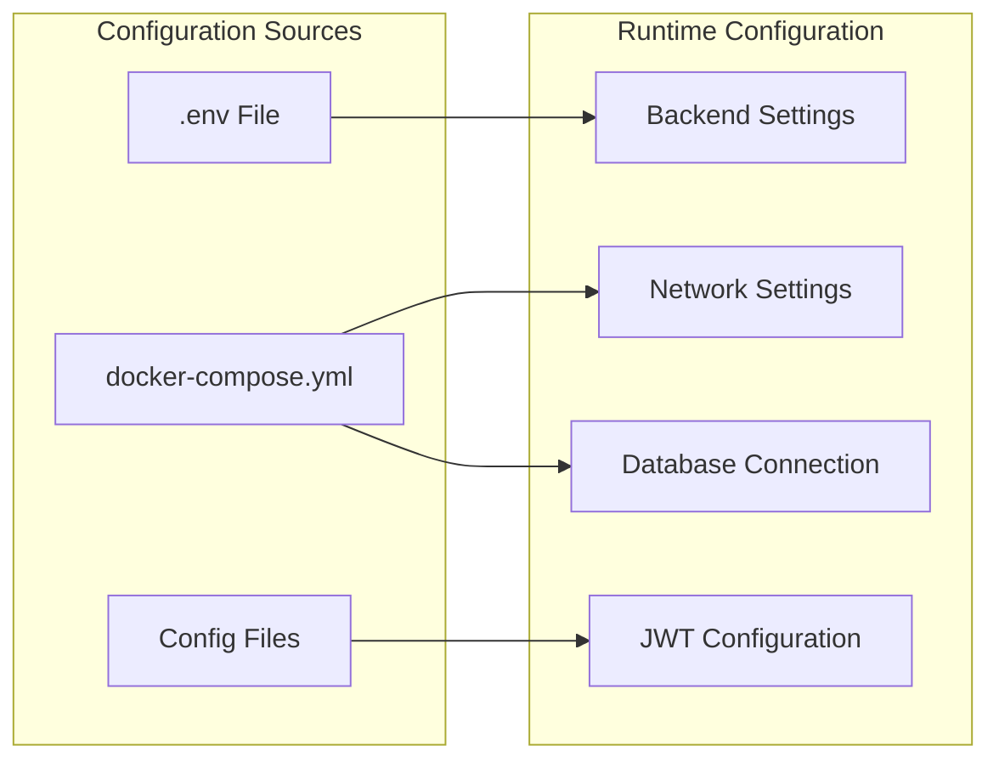

# Design Document

## Overview

本设计文档描述了如何将之前修复的数据库相关问题系统化地同步到 docker-compose 配置中。设计重点关注容器化环境的一致性、自动化初始化和配置管理。

## Architecture

### 容器架构优化



### 配置管理架构



## Components and Interfaces

### 1. 数据库初始化组件

**InitializationService**
- 职责：处理数据库初始化和默认数据创建
- 接口：
  - `initialize_database()`: 创建表结构
  - `create_default_users()`: 创建默认用户账户
  - `verify_initialization()`: 验证初始化状态

**DatabaseHealthCheck**
- 职责：监控数据库连接状态
- 接口：
  - `check_connection()`: 检查数据库连接
  - `wait_for_ready()`: 等待数据库就绪
  - `get_health_status()`: 获取健康状态

### 2. 配置管理组件

**EnvironmentConfig**
- 职责：管理环境变量和配置
- 接口：
  - `load_config()`: 加载配置文件
  - `validate_config()`: 验证配置完整性
  - `get_database_url()`: 获取数据库连接字符串

**JWTConfigManager**
- 职责：管理 JWT 相关配置
- 接口：
  - `generate_secret_key()`: 生成密钥
  - `validate_key_format()`: 验证密钥格式
  - `get_jwt_settings()`: 获取 JWT 设置

### 3. 网络配置组件

**ProxyConfiguration**
- 职责：管理前端代理配置
- 接口：
  - `configure_api_proxy()`: 配置 API 代理
  - `configure_websocket_proxy()`: 配置 WebSocket 代理
  - `validate_proxy_settings()`: 验证代理设置

## Data Models

### 配置数据模型

```typescript
interface DockerComposeConfig {
  version: string
  services: {
    [serviceName: string]: ServiceConfig
  }
  volumes: VolumeConfig
  networks: NetworkConfig
}

interface ServiceConfig {
  image?: string
  build?: BuildConfig
  environment: EnvironmentVariables
  ports: string[]
  depends_on: DependencyConfig
  volumes: string[]
  healthcheck?: HealthCheckConfig
}

interface EnvironmentVariables {
  DATABASE_URL: string
  REDIS_URL: string
  JWT_SECRET_KEY: string
  DEBUG: boolean
  [key: string]: string | boolean | number
}
```

### 初始化数据模型

```python
@dataclass
class InitializationConfig:
    database_url: str
    admin_user: UserConfig
    default_users: List[UserConfig]
    retry_attempts: int = 3
    timeout_seconds: int = 30

@dataclass
class UserConfig:
    username: str
    password: str
    email: str
    role: UserRole
    full_name: str
    is_active: bool = True
```

## Error Handling

### 数据库初始化错误处理

1. **连接超时处理**
   - 实现指数退避重试机制
   - 最大重试次数：5次
   - 超时时间：30秒

2. **模型关系错误处理**
   - 验证外键约束
   - 检查循环依赖
   - 提供详细错误信息

3. **用户创建错误处理**
   - 检查用户名唯一性
   - 验证邮箱格式
   - 处理密码哈希错误

### 配置错误处理

1. **环境变量缺失**
   - 提供默认值
   - 记录警告日志
   - 验证必需配置

2. **网络配置错误**
   - 验证端口可用性
   - 检查容器名称解析
   - 提供连接测试

## Testing Strategy

### 单元测试

1. **配置管理测试**
   - 测试配置加载和验证
   - 测试环境变量处理
   - 测试默认值设置

2. **数据库初始化测试**
   - 测试表创建逻辑
   - 测试用户创建流程
   - 测试错误恢复机制

### 集成测试

1. **容器启动测试**
   - 测试完整的容器启动流程
   - 验证服务间通信
   - 测试健康检查机制

2. **端到端测试**
   - 测试用户登录流程
   - 测试 API 调用链路
   - 测试前端图表渲染

### 性能测试

1. **启动时间测试**
   - 测量容器启动时间
   - 测量数据库初始化时间
   - 优化启动性能

2. **资源使用测试**
   - 监控内存使用情况
   - 监控 CPU 使用情况
   - 优化资源配置

## Implementation Considerations

### 向后兼容性

- 保持现有 API 接口不变
- 支持渐进式迁移
- 提供配置迁移工具

### 安全性

- 使用环境变量管理敏感信息
- 实现密钥轮换机制
- 加强容器间通信安全

### 可维护性

- 提供详细的配置文档
- 实现配置验证工具
- 建立监控和告警机制

### 扩展性

- 支持多环境配置
- 支持动态配置更新
- 预留扩展接口