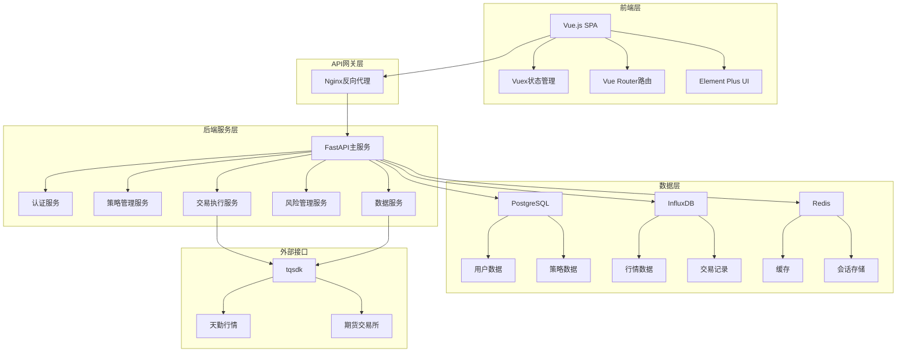
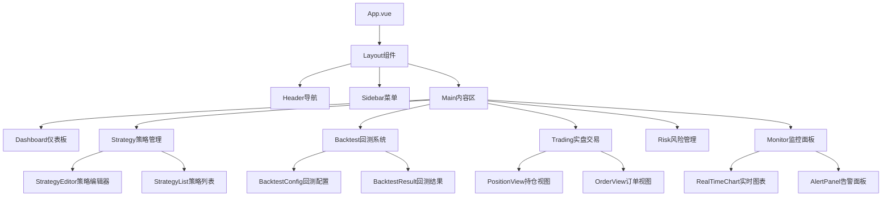
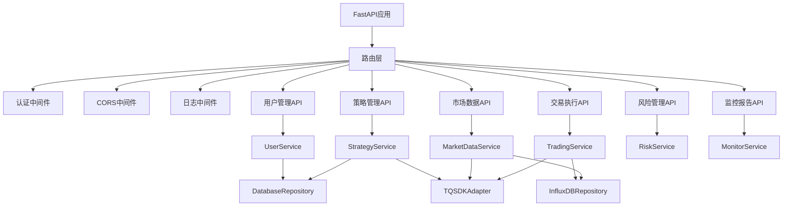
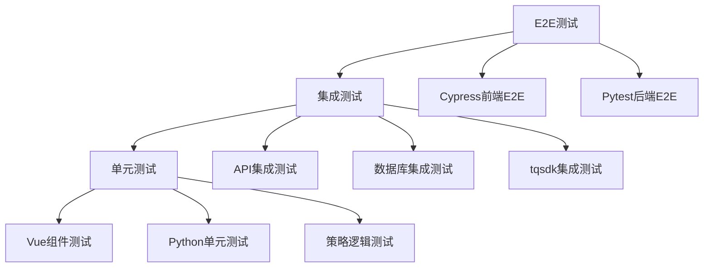

# 设计文档

## 概述

量化交易平台采用前后端分离的微服务架构，后端基于FastAPI构建RESTful API服务，前端使用Vue.js构建单页应用。系统通过tqsdk与期货市场进行数据交互和交易执行，支持策略开发、回测、实盘交易和风险管理的完整工作流。

## 架构

### 系统架构图



### 技术栈

**前端技术栈：**
- Vue.js 3.x - 主框架
- TypeScript - 类型安全
- Vuex 4.x - 状态管理
- Vue Router 4.x - 路由管理
- Element Plus - UI组件库
- ECharts - 图表可视化
- WebSocket - 实时数据通信

**后端技术栈：**
- FastAPI - Web框架
- Python 3.9+ - 编程语言
- tqsdk - 量化交易SDK
- SQLAlchemy - ORM框架
- Alembic - 数据库迁移
- Celery - 异步任务队列
- Redis - 缓存和消息队列
- WebSocket - 实时通信

**数据存储：**
- PostgreSQL - 关系型数据库
- InfluxDB - 时序数据库
- Redis - 内存数据库

## 组件和接口

### 前端组件架构



### 后端服务架构



### API接口设计

**认证接口：**
```
POST /api/auth/login - 用户登录
POST /api/auth/logout - 用户登出
POST /api/auth/refresh - 刷新令牌
GET /api/auth/profile - 获取用户信息
```

**策略管理接口：**
```
GET /api/strategies - 获取策略列表
POST /api/strategies - 创建新策略
GET /api/strategies/{id} - 获取策略详情
PUT /api/strategies/{id} - 更新策略
DELETE /api/strategies/{id} - 删除策略
POST /api/strategies/{id}/validate - 验证策略代码
```

**市场数据接口：**
```
GET /api/market/instruments - 获取合约列表
GET /api/market/quotes/{symbol} - 获取实时行情
GET /api/market/klines/{symbol} - 获取K线数据
WebSocket /ws/market - 实时行情推送
```

**交易执行接口：**
```
POST /api/trading/orders - 下单
GET /api/trading/orders - 获取订单列表
DELETE /api/trading/orders/{id} - 撤单
GET /api/trading/positions - 获取持仓信息
GET /api/trading/account - 获取账户信息
```

## 数据模型

### 用户相关模型

```python
class User(BaseModel):
    id: int
    username: str
    email: str
    role: UserRole
    created_at: datetime
    updated_at: datetime
    is_active: bool

class UserRole(str, Enum):
    ADMIN = "admin"
    TRADER = "trader"
    VIEWER = "viewer"
```

### 策略相关模型

```python
class Strategy(BaseModel):
    id: int
    name: str
    description: str
    code: str
    language: str = "python"
    user_id: int
    status: StrategyStatus
    created_at: datetime
    updated_at: datetime

class StrategyStatus(str, Enum):
    DRAFT = "draft"
    TESTING = "testing"
    ACTIVE = "active"
    PAUSED = "paused"
    STOPPED = "stopped"
```

### 交易相关模型

```python
class Order(BaseModel):
    id: str
    strategy_id: int
    symbol: str
    direction: OrderDirection
    offset: OrderOffset
    volume: int
    price: float
    status: OrderStatus
    created_at: datetime
    filled_at: Optional[datetime]

class Position(BaseModel):
    symbol: str
    direction: PositionDirection
    volume: int
    price: float
    unrealized_pnl: float
    margin: float
    updated_at: datetime
```

### 市场数据模型

```python
class Quote(BaseModel):
    symbol: str
    last_price: float
    bid_price: float
    ask_price: float
    volume: int
    timestamp: datetime

class Kline(BaseModel):
    symbol: str
    datetime: datetime
    open: float
    high: float
    low: float
    close: float
    volume: int
```

## 错误处理

### 错误分类

1. **业务逻辑错误**：策略验证失败、风险检查不通过等
2. **系统错误**：数据库连接失败、外部API调用超时等
3. **用户输入错误**：参数验证失败、权限不足等

### 错误响应格式

```python
class ErrorResponse(BaseModel):
    error_code: str
    error_message: str
    details: Optional[Dict[str, Any]]
    timestamp: datetime

# 示例错误响应
{
    "error_code": "STRATEGY_VALIDATION_FAILED",
    "error_message": "策略代码存在语法错误",
    "details": {
        "line": 15,
        "column": 8,
        "syntax_error": "unexpected token"
    },
    "timestamp": "2024-01-01T10:00:00Z"
}
```

### 异常处理机制

```python
@app.exception_handler(ValidationError)
async def validation_exception_handler(request: Request, exc: ValidationError):
    return JSONResponse(
        status_code=400,
        content=ErrorResponse(
            error_code="VALIDATION_ERROR",
            error_message="输入参数验证失败",
            details={"validation_errors": exc.errors()},
            timestamp=datetime.utcnow()
        ).dict()
    )
```

## 测试策略

### 测试金字塔



### 前端测试

**单元测试：**
- Vue Test Utils + Jest
- 组件渲染测试
- 用户交互测试
- Vuex状态管理测试

**E2E测试：**
- Cypress测试框架
- 用户工作流测试
- 跨浏览器兼容性测试

### 后端测试

**单元测试：**
- pytest测试框架
- 服务层逻辑测试
- 数据模型验证测试
- Mock外部依赖

**集成测试：**
- FastAPI TestClient
- 数据库事务测试
- tqsdk模拟交易测试
- WebSocket连接测试

### 策略测试

**回测测试：**
- 历史数据回测验证
- 性能指标计算测试
- 边界条件测试

**模拟交易测试：**
- 沙盒环境测试
- 风险控制测试
- 异常情况处理测试

### 性能测试

**负载测试：**
- 并发用户访问测试
- 实时数据推送压力测试
- 数据库查询性能测试

**压力测试：**
- 系统极限负载测试
- 内存和CPU使用率监控
- 响应时间基准测试