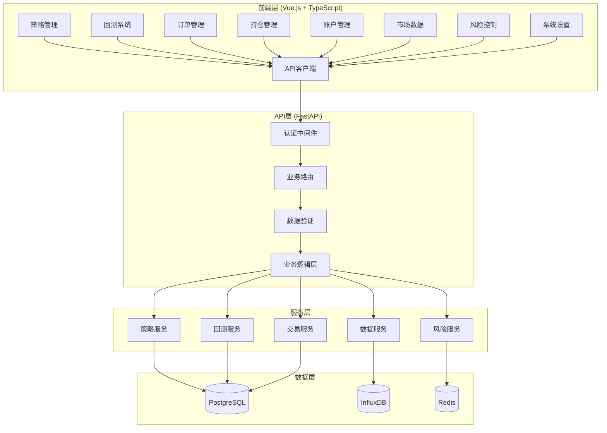
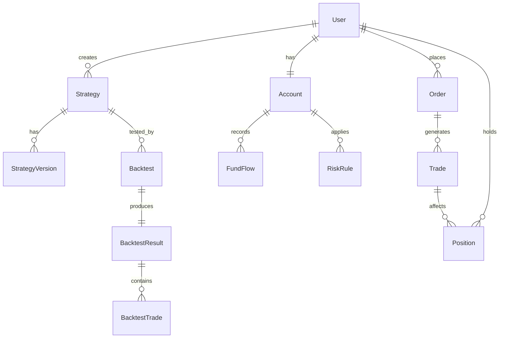

# 量化交易平台核心功能设计文档

## 概述

本设计文档描述了量化交易平台8个核心功能模块的技术实现方案。设计遵循前后端分离架构，使用Vue.js + TypeScript前端和FastAPI + Python后端，确保系统的可扩展性、可维护性和用户体验。

## 架构设计

### 整体架构



### 技术栈

**前端技术栈：**
- Vue.js 3 + Composition API
- TypeScript
- Element Plus UI组件库
- Pinia状态管理
- Vue Router路由管理
- ECharts图表库
- Monaco Editor代码编辑器

**后端技术栈：**
- FastAPI框架
- SQLAlchemy ORM
- Alembic数据库迁移
- Pydantic数据验证
- Celery异步任务
- Redis缓存
- InfluxDB时序数据库

## 组件和接口设计

### 1. 策略管理系统

#### 前端组件结构
```
src/views/strategies/
├── StrategiesView.vue          # 策略列表页面
├── StrategyDetailView.vue      # 策略详情页面
├── StrategyEditorView.vue      # 策略编辑器
├── StrategyTestView.vue        # 策略测试页面
└── components/
    ├── StrategyCard.vue        # 策略卡片组件
    ├── StrategyForm.vue        # 策略表单组件
    ├── CodeEditor.vue          # 代码编辑器组件
    └── VersionHistory.vue      # 版本历史组件
```

#### 后端API接口
```python
# 策略管理API
GET    /api/v1/strategies/              # 获取策略列表
POST   /api/v1/strategies/              # 创建新策略
GET    /api/v1/strategies/{id}          # 获取策略详情
PUT    /api/v1/strategies/{id}          # 更新策略
DELETE /api/v1/strategies/{id}          # 删除策略
GET    /api/v1/strategies/{id}/versions # 获取策略版本历史
POST   /api/v1/strategies/{id}/test     # 测试策略代码
```

#### 数据模型
```python
class Strategy(Base):
    __tablename__ = "strategies"
    
    id = Column(Integer, primary_key=True)
    name = Column(String(100), nullable=False)
    description = Column(Text)
    code = Column(Text, nullable=False)
    language = Column(String(20), default="python")
    status = Column(Enum(StrategyStatus), default=StrategyStatus.DRAFT)
    user_id = Column(Integer, ForeignKey("users.id"))
    created_at = Column(DateTime, default=datetime.utcnow)
    updated_at = Column(DateTime, default=datetime.utcnow, onupdate=datetime.utcnow)
    
    # 关系
    user = relationship("User", back_populates="strategies")
    versions = relationship("StrategyVersion", back_populates="strategy")
    backtests = relationship("Backtest", back_populates="strategy")
```

### 2. 回测系统

#### 前端组件结构
```
src/views/backtests/
├── BacktestsView.vue           # 回测列表页面
├── BacktestConfigView.vue      # 回测配置页面
├── BacktestResultView.vue      # 回测结果页面
├── BacktestCompareView.vue     # 回测对比页面
└── components/
    ├── BacktestCard.vue        # 回测卡片组件
    ├── BacktestForm.vue        # 回测配置表单
    ├── PerformanceChart.vue    # 性能图表组件
    ├── RiskMetrics.vue         # 风险指标组件
    └── TradeHistory.vue        # 交易历史组件
```

#### 后端API接口
```python
# 回测系统API
GET    /api/v1/backtests/              # 获取回测列表
POST   /api/v1/backtests/              # 创建回测任务
GET    /api/v1/backtests/{id}          # 获取回测详情
GET    /api/v1/backtests/{id}/result   # 获取回测结果
POST   /api/v1/backtests/{id}/stop     # 停止回测任务
DELETE /api/v1/backtests/{id}          # 删除回测
GET    /api/v1/backtests/compare       # 回测对比分析
```

#### 回测引擎设计
```python
class BacktestEngine:
    def __init__(self, strategy_code: str, config: BacktestConfig):
        self.strategy_code = strategy_code
        self.config = config
        self.portfolio = Portfolio(config.initial_capital)
        self.data_provider = DataProvider()
        
    async def run_backtest(self) -> BacktestResult:
        # 1. 加载历史数据
        data = await self.data_provider.get_historical_data(
            symbols=self.config.symbols,
            start_date=self.config.start_date,
            end_date=self.config.end_date
        )
        
        # 2. 执行策略逻辑
        for timestamp, market_data in data:
            signals = self.execute_strategy(market_data)
            self.process_signals(signals, timestamp)
            
        # 3. 计算性能指标
        return self.calculate_performance_metrics()
```

### 3. 订单管理系统

#### 前端组件结构
```
src/views/orders/
├── OrdersView.vue              # 订单列表页面
├── CreateOrderView.vue         # 创建订单页面
├── OrderDetailView.vue         # 订单详情页面
└── components/
    ├── OrderTable.vue          # 订单表格组件
    ├── OrderForm.vue           # 订单表单组件
    ├── OrderStatus.vue         # 订单状态组件
    └── OrderFilter.vue         # 订单筛选组件
```

#### 订单状态管理
```typescript
enum OrderStatus {
  PENDING = 'pending',           // 待提交
  SUBMITTED = 'submitted',       // 已提交
  PARTIAL_FILLED = 'partial_filled', // 部分成交
  FILLED = 'filled',            // 完全成交
  CANCELLED = 'cancelled',      // 已取消
  REJECTED = 'rejected'         // 已拒绝
}

interface Order {
  id: number
  symbol: string
  side: 'buy' | 'sell'
  type: 'market' | 'limit' | 'stop'
  quantity: number
  price?: number
  stop_price?: number
  status: OrderStatus
  filled_quantity: number
  average_price?: number
  created_at: string
  updated_at: string
}
```

### 4. 持仓管理系统

#### 前端组件结构
```
src/views/positions/
├── PositionsView.vue           # 持仓列表页面
├── PositionDetailView.vue      # 持仓详情页面
└── components/
    ├── PositionTable.vue       # 持仓表格组件
    ├── PositionCard.vue        # 持仓卡片组件
    ├── PnLChart.vue           # 盈亏图表组件
    └── RiskIndicator.vue       # 风险指标组件
```

#### 持仓计算逻辑
```python
class Position:
    def __init__(self, symbol: str):
        self.symbol = symbol
        self.quantity = 0
        self.average_cost = 0
        self.total_cost = 0
        self.realized_pnl = 0
        
    def add_trade(self, quantity: int, price: float):
        if self.quantity == 0:
            # 新建仓位
            self.quantity = quantity
            self.average_cost = price
            self.total_cost = quantity * price
        elif (self.quantity > 0 and quantity > 0) or (self.quantity < 0 and quantity < 0):
            # 加仓
            new_total_cost = self.total_cost + quantity * price
            new_quantity = self.quantity + quantity
            self.average_cost = new_total_cost / new_quantity
            self.quantity = new_quantity
            self.total_cost = new_total_cost
        else:
            # 减仓或平仓
            self.realized_pnl += min(abs(quantity), abs(self.quantity)) * (price - self.average_cost) * (1 if self.quantity > 0 else -1)
            self.quantity += quantity
            if self.quantity == 0:
                self.total_cost = 0
                self.average_cost = 0
    
    def get_unrealized_pnl(self, current_price: float) -> float:
        if self.quantity == 0:
            return 0
        return self.quantity * (current_price - self.average_cost)
```

### 5. 账户管理系统

#### 前端组件结构
```
src/views/account/
├── AccountView.vue             # 账户概览页面
├── ProfileView.vue             # 个人信息页面
├── FundsView.vue              # 资金管理页面
├── StatisticsView.vue         # 交易统计页面
└── components/
    ├── AccountSummary.vue      # 账户摘要组件
    ├── FundFlow.vue           # 资金流水组件
    ├── TradingStats.vue       # 交易统计组件
    └── RiskProfile.vue        # 风险偏好组件
```

#### 账户数据模型
```python
class Account(Base):
    __tablename__ = "accounts"
    
    id = Column(Integer, primary_key=True)
    user_id = Column(Integer, ForeignKey("users.id"), unique=True)
    account_type = Column(Enum(AccountType), default=AccountType.DEMO)
    initial_capital = Column(Numeric(15, 2), default=100000)
    available_cash = Column(Numeric(15, 2))
    frozen_cash = Column(Numeric(15, 2), default=0)
    total_assets = Column(Numeric(15, 2))
    total_liabilities = Column(Numeric(15, 2), default=0)
    net_assets = Column(Numeric(15, 2))
    created_at = Column(DateTime, default=datetime.utcnow)
    updated_at = Column(DateTime, default=datetime.utcnow, onupdate=datetime.utcnow)
```

### 6. 市场数据系统

#### 前端组件结构
```
src/views/market/
├── MarketView.vue              # 市场数据主页
├── QuotesView.vue             # 行情列表页面
├── ChartView.vue              # 图表分析页面
├── DepthView.vue              # 深度数据页面
└── components/
    ├── QuoteTable.vue          # 行情表格组件
    ├── TradingChart.vue        # 交易图表组件
    ├── DepthChart.vue          # 深度图表组件
    ├── TickerSearch.vue        # 标的搜索组件
    └── TechnicalIndicators.vue # 技术指标组件
```

#### 实时数据推送
```typescript
class MarketDataService {
  private ws: WebSocket | null = null
  private subscribers: Map<string, Set<Function>> = new Map()
  
  connect() {
    this.ws = new WebSocket('ws://localhost:8000/api/v1/ws/market')
    
    this.ws.onmessage = (event) => {
      const data = JSON.parse(event.data)
      this.notifySubscribers(data.symbol, data)
    }
  }
  
  subscribe(symbol: string, callback: Function) {
    if (!this.subscribers.has(symbol)) {
      this.subscribers.set(symbol, new Set())
      // 发送订阅请求
      this.ws?.send(JSON.stringify({
        action: 'subscribe',
        symbol: symbol
      }))
    }
    this.subscribers.get(symbol)?.add(callback)
  }
  
  private notifySubscribers(symbol: string, data: any) {
    this.subscribers.get(symbol)?.forEach(callback => callback(data))
  }
}
```

### 7. 风险控制系统

#### 前端组件结构
```
src/views/risk/
├── RiskControlView.vue         # 风险控制主页
├── RiskRulesView.vue          # 风险规则页面
├── RiskMonitorView.vue        # 风险监控页面
├── RiskReportView.vue         # 风险报告页面
└── components/
    ├── RiskDashboard.vue       # 风险仪表板组件
    ├── RiskRuleForm.vue        # 风险规则表单
    ├── RiskAlert.vue           # 风险警告组件
    └── RiskMetrics.vue         # 风险指标组件
```

#### 风险控制引擎
```python
class RiskControlEngine:
    def __init__(self):
        self.rules: List[RiskRule] = []
        self.monitors: List[RiskMonitor] = []
    
    def add_rule(self, rule: RiskRule):
        self.rules.append(rule)
    
    def check_order(self, order: Order, account: Account) -> RiskCheckResult:
        for rule in self.rules:
            result = rule.check(order, account)
            if not result.passed:
                return result
        return RiskCheckResult(passed=True)
    
    def monitor_positions(self, positions: List[Position]) -> List[RiskAlert]:
        alerts = []
        for monitor in self.monitors:
            alert = monitor.check(positions)
            if alert:
                alerts.append(alert)
        return alerts

class PositionLimitRule(RiskRule):
    def __init__(self, max_position_ratio: float):
        self.max_position_ratio = max_position_ratio
    
    def check(self, order: Order, account: Account) -> RiskCheckResult:
        # 检查单个标的持仓比例是否超限
        position_value = order.quantity * order.price
        position_ratio = position_value / account.net_assets
        
        if position_ratio > self.max_position_ratio:
            return RiskCheckResult(
                passed=False,
                message=f"单个标的持仓比例超限: {position_ratio:.2%} > {self.max_position_ratio:.2%}"
            )
        return RiskCheckResult(passed=True)
```

### 8. 系统设置

#### 前端组件结构
```
src/views/settings/
├── SettingsView.vue            # 设置主页
├── UserSettingsView.vue       # 用户设置页面
├── TradingSettingsView.vue    # 交易设置页面
├── SystemSettingsView.vue     # 系统设置页面（管理员）
└── components/
    ├── SettingsCard.vue        # 设置卡片组件
    ├── ThemeSelector.vue       # 主题选择器
    ├── NotificationSettings.vue # 通知设置组件
    └── DataExport.vue          # 数据导出组件
```

## 数据模型设计

### 核心实体关系图



### 数据库表设计

**策略相关表：**
- `strategies` - 策略基本信息
- `strategy_versions` - 策略版本历史
- `strategy_parameters` - 策略参数配置

**交易相关表：**
- `orders` - 订单信息
- `trades` - 成交记录
- `positions` - 持仓信息
- `position_history` - 持仓历史

**回测相关表：**
- `backtests` - 回测任务
- `backtest_results` - 回测结果
- `backtest_trades` - 回测交易记录

**风险控制表：**
- `risk_rules` - 风险规则
- `risk_alerts` - 风险警告
- `risk_metrics` - 风险指标

## 错误处理策略

### 前端错误处理
```typescript
// 全局错误处理
app.config.errorHandler = (err, vm, info) => {
  console.error('Vue Error:', err, info)
  ElMessage.error('系统错误，请稍后重试')
}

// API错误处理
const handleApiError = (error: any) => {
  if (error.response?.status === 401) {
    // 未授权，跳转登录
    router.push('/login')
  } else if (error.response?.status === 403) {
    // 权限不足
    ElMessage.error('权限不足')
  } else if (error.response?.status >= 500) {
    // 服务器错误
    ElMessage.error('服务器错误，请稍后重试')
  } else {
    // 其他错误
    ElMessage.error(error.message || '请求失败')
  }
}
```

### 后端错误处理
```python
# 自定义异常类
class TradingPlatformException(Exception):
    def __init__(self, message: str, code: str = None):
        self.message = message
        self.code = code
        super().__init__(message)

class InsufficientFundsException(TradingPlatformException):
    def __init__(self):
        super().__init__("资金不足", "INSUFFICIENT_FUNDS")

class RiskControlException(TradingPlatformException):
    def __init__(self, message: str):
        super().__init__(message, "RISK_CONTROL_VIOLATION")

# 全局异常处理器
@app.exception_handler(TradingPlatformException)
async def trading_exception_handler(request: Request, exc: TradingPlatformException):
    return JSONResponse(
        status_code=400,
        content={
            "success": False,
            "message": exc.message,
            "code": exc.code,
            "timestamp": datetime.utcnow().isoformat()
        }
    )
```

## 测试策略

### 单元测试
- 前端组件测试使用 Vitest + Vue Test Utils
- 后端API测试使用 pytest + httpx
- 数据库测试使用测试数据库和事务回滚

### 集成测试
- API集成测试覆盖完整的请求-响应流程
- 前后端集成测试使用 Cypress 进行端到端测试

### 性能测试
- 使用 Locust 进行负载测试
- 数据库查询性能优化和索引设计
- 前端组件渲染性能优化

这个设计文档提供了实现8个核心功能模块的详细技术方案，确保系统的完整性、可扩展性和用户体验。