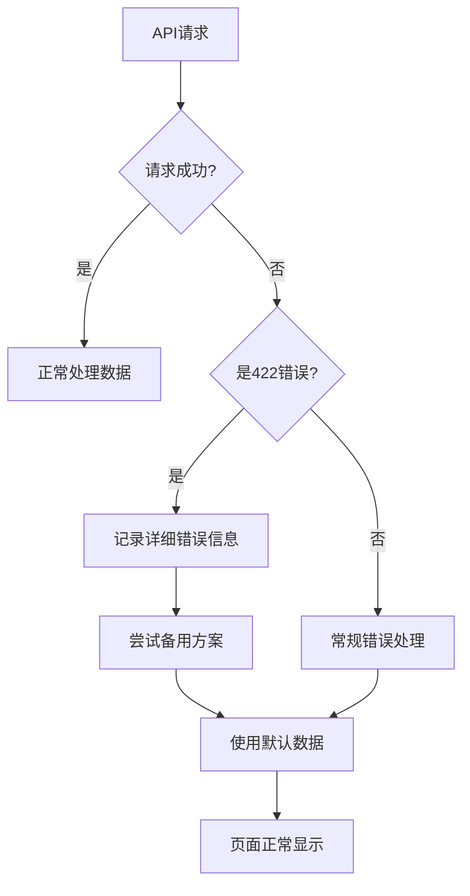

# 仪表板422错误修复方案

## 问题描述

用户反映首页会出现"请求参数错误"的提示，经过分析发现是HTTP 422错误，通常表示请求参数验证失败。

## 问题分析

### 可能的原因

1. **API路径不匹配**: 前端调用的API路径与后端定义不一致
2. **参数格式错误**: 请求参数格式不符合后端验证规则
3. **认证token问题**: token格式或内容不正确
4. **后端验证逻辑过严**: 后端参数验证过于严格

### 涉及的API端点

- `GET /api/v1/auth/me` - 获取当前用户信息
- `GET /api/v1/dashboard/summary` - 获取仪表板摘要
- `GET /api/v1/user/profile` - 获取用户资料

## 修复方案

### 1. 前端错误处理增强

#### 认证Store修复 (`frontend/src/stores/auth.ts`)

```typescript
// 在getCurrentUser方法中添加422错误的特殊处理
if (error.response?.status === 422) {
  console.warn('⚠️ 检测到422错误，可能是API参数问题，尝试使用基本用户信息')
  // 从token中解析基本用户信息作为备用方案
  if (token.value) {
    try {
      const tokenPayload = JSON.parse(atob(token.value.split('.')[1]))
      user.value = {
        id: tokenPayload.sub || tokenPayload.user_id,
        username: tokenPayload.username || 'unknown',
        email: tokenPayload.email || '',
        role: tokenPayload.role || 'viewer',
        is_active: true,
        is_verified: true,
        created_at: '',
        updated_at: ''
      } as User
      return
    } catch (tokenError) {
      console.error('❌ 解析token失败:', tokenError)
    }
  }
}
```

#### 仪表板组件修复 (`frontend/src/views/dashboard/DashboardView.vue`)

```typescript
// 在API调用中添加422错误处理
catch (error: any) {
  console.error('❌ 加载仪表板摘要失败:', error)
  
  // 如果是422错误，提供更详细的错误信息
  if (error.response?.status === 422) {
    console.error('❌ 422错误详情:', error.response.data)
    console.warn('⚠️ 仪表板API参数错误，使用默认数据')
  }
  
  // 使用默认数据，确保页面能正常显示
  dashboardData.accountBalance = 0
  dashboardData.activeOrders = 0
  dashboardData.activePositions = 0
  dashboardData.marketStatus = 'closed'
  dashboardData.todayPnl = 0
}
```

### 2. 优雅降级策略

1. **API失败时使用默认数据**: 确保页面能正常显示
2. **Token解析备用方案**: 从JWT token中提取基本用户信息
3. **详细错误日志**: 记录422错误的详细信息便于调试
4. **用户友好提示**: 不向用户显示技术错误信息

### 3. 错误处理流程



## 测试验证

### 测试脚本

创建了 `test-dashboard-fix.sh` 脚本来验证修复效果：

```bash
#!/bin/bash
# 测试各个API端点的响应
curl -X GET "http://localhost:8000/api/v1/auth/me" -H "Authorization: Bearer $TOKEN"
curl -X GET "http://localhost:8000/api/v1/dashboard/summary" -H "Authorization: Bearer $TOKEN"
curl -X GET "http://localhost:8000/api/v1/user/profile" -H "Authorization: Bearer $TOKEN"
```

### 验证步骤

1. 启动后端服务
2. 运行测试脚本: `./test-dashboard-fix.sh`
3. 检查API响应是否正常
4. 访问前端仪表板页面验证修复效果

## 预期效果

### 修复前
- 用户看到"请求参数错误"提示
- 仪表板页面可能显示异常
- 控制台出现422错误

### 修复后
- 即使API返回422错误，页面也能正常显示
- 使用默认数据或备用方案保证功能可用
- 详细的错误日志便于开发者调试
- 用户体验不受影响

## 长期解决方案

1. **后端API优化**: 检查并优化后端参数验证逻辑
2. **API文档完善**: 确保前后端API契约一致
3. **集成测试**: 添加前后端集成测试覆盖这些场景
4. **监控告警**: 添加422错误的监控和告警

## 相关文件

- `frontend/src/stores/auth.ts` - 认证store修复
- `frontend/src/views/dashboard/DashboardView.vue` - 仪表板组件修复
- `test-dashboard-fix.sh` - 测试脚本
- `DASHBOARD_422_ERROR_FIX.md` - 本文档

## 总结

通过增强前端错误处理和实现优雅降级策略，我们确保了即使后端API出现422参数验证错误，前端仍能正常工作并为用户提供良好的体验。这种方案既解决了当前问题，又为系统的健壮性提供了保障。