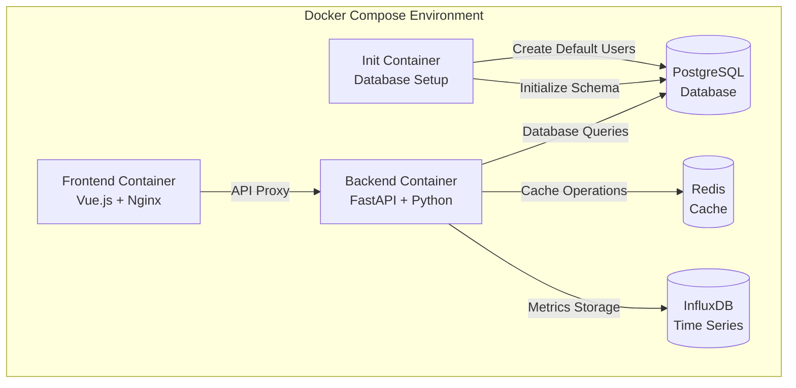

# 量化交易平台

基于tqsdk、FastAPI和Vue.js构建的量化交易平台，提供策略开发、回测、实盘交易和风险管理的完整解决方案。

## 项目结构

```
quantitative-trading-platform/
├── backend/                    # 后端服务 (FastAPI + Python)
│   ├── app/
│   │   ├── api/               # API路由
│   │   │   └── v1/           # API v1版本
│   │   ├── core/             # 核心模块
│   │   │   ├── config.py     # 配置管理
│   │   │   ├── database.py   # 数据库连接
│   │   │   ├── security.py   # 安全认证
│   │   │   └── exceptions.py # 异常处理
│   │   ├── models/           # 数据模型
│   │   ├── schemas/          # Pydantic模式
│   │   ├── services/         # 业务逻辑
│   │   └── main.py          # 应用入口
│   ├── alembic/              # 数据库迁移
│   ├── tests/                # 测试代码
│   ├── requirements.txt      # Python依赖
│   └── pyproject.toml       # 项目配置
├── frontend/                   # 前端应用 (Vue.js + TypeScript)
│   ├── src/
│   │   ├── api/              # API客户端
│   │   ├── components/       # Vue组件
│   │   ├── views/            # 页面视图
│   │   ├── stores/           # Pinia状态管理
│   │   ├── router/           # 路由配置
│   │   ├── types/            # TypeScript类型
│   │   └── utils/            # 工具函数
│   ├── tests/                # 测试代码
│   ├── package.json          # Node.js依赖
│   └── vite.config.ts       # Vite配置
├── docker/                    # Docker配置
├── docs/                      # 项目文档
│   ├── api-documentation.md   # API文档
│   ├── user-manual.md        # 用户手册
│   └── admin-guide.md        # 管理员指南
├── scripts/                   # 部署脚本
├── k8s/                      # Kubernetes配置
└── README.md                 # 项目说明
```

## 技术栈

### 后端
- **FastAPI** - 现代Python Web框架
- **tqsdk** - 天勤量化交易SDK
- **SQLAlchemy** - ORM框架
- **PostgreSQL** - 关系型数据库
- **InfluxDB** - 时序数据库
- **Redis** - 缓存和消息队列
- **Celery** - 异步任务队列

### 前端
- **Vue.js 3** - 渐进式JavaScript框架
- **TypeScript** - 类型安全
- **Element Plus** - UI组件库
- **ECharts** - 图表可视化
- **Vite** - 构建工具

## 快速开始

### 🚀 一键启动（推荐）

使用我们提供的自动化启动脚本，一键启动整个平台：

```bash
# 克隆项目
git clone https://github.com/your-org/quantitative-trading-platform.git
cd quantitative-trading-platform

# 一键启动所有服务
./start-trading-platform.sh

# 或者清理后启动
./start-trading-platform.sh start --clean
```

启动完成后访问：
- 🌐 前端应用: http://localhost:3000
- 🔧 后端API: http://localhost:8000
- 📚 API文档: http://localhost:8000/docs

### 环境要求

- Docker 20.10+
- Docker Compose 2.0+
- 4GB+ 可用内存
- 10GB+ 可用磁盘空间

### 手动部署

如果需要手动控制部署过程：

1. **配置环境变量**
```bash
# 从模板创建环境变量文件
cp .env.template .env
# 根据需要修改配置
vim .env
```

2. **启动服务**
```bash
# 构建并启动所有服务
docker-compose up -d --build

# 查看服务状态
docker-compose ps

# 查看日志
docker-compose logs -f
```

3. **验证部署**
```bash
# 运行配置验证
python3 validate_all_configs.py

# 运行启动验证
python3 validate_startup.py
```

### 本地开发设置

如果需要本地开发环境：

#### 后端设置

1. 创建虚拟环境
```bash
cd backend
python -m venv venv
source venv/bin/activate  # Linux/Mac
# 或 venv\Scripts\activate  # Windows
```

2. 安装依赖
```bash
pip install -r requirements.txt
```

3. 配置环境变量
```bash
cp .env.example .env
# 编辑 .env 文件，配置数据库连接等信息
```

4. 启动开发服务器
```bash
python start_backend.py
```

#### 前端设置

1. 安装依赖
```bash
cd frontend
npm install
```

2. 启动开发服务器
```bash
npm run dev
```

3. 构建生产版本
```bash
npm run build
```

## 开发指南

### 开发环境设置

#### 使用Docker Compose（推荐）

我们的 Docker Compose 配置包含自动化的数据库初始化和健康检查：

1. **克隆项目**
```bash
git clone https://github.com/your-org/quantitative-trading-platform.git
cd quantitative-trading-platform
```

2. **配置环境变量**
```bash
# 从模板创建环境变量文件
cp .env.template .env
# 根据需要修改配置
```

3. **启动所有服务**
```bash
# 使用启动脚本（推荐）
./start-trading-platform.sh

# 或手动启动
docker-compose up -d --build
```

4. **验证部署**
```bash
# 检查服务状态
docker-compose ps

# 验证配置
python3 validate_all_configs.py

# 验证启动状态
python3 test_startup_config.py
```

5. **访问应用**
- 🌐 前端应用: http://localhost:3000
- 🔧 后端API: http://localhost:8000
- 📚 API文档: http://localhost:8000/docs
- 🗄️ PostgreSQL: localhost:5432
- 🔄 Redis: localhost:6379
- 📊 InfluxDB: http://localhost:8086

#### 服务架构



#### 默认用户账户

系统会自动创建以下默认用户：

| 用户名 | 密码 | 角色 | 邮箱 |
|--------|------|------|------|
| admin | admin123 | 管理员 | admin@trading.com |
| trader | trader123 | 交易员 | trader@trading.com |
| observer | observer123 | 观察者 | observer@trading.com |

#### 本地开发设置

参考上面的"手动部署"部分进行本地开发环境设置。

### 代码规范

#### 后端代码规范

- 使用 **Black** 进行代码格式化
- 使用 **isort** 进行导入排序
- 使用 **flake8** 进行代码检查
- 使用 **mypy** 进行类型检查

```bash
# 安装开发工具
pip install black isort flake8 mypy

# 格式化代码
black app/
isort app/

# 代码检查
flake8 app/
mypy app/
```

#### 前端代码规范

- 使用 **ESLint** 进行代码检查
- 使用 **Prettier** 进行代码格式化
- 使用 **TypeScript** 进行类型检查

```bash
# 代码检查和格式化
npm run lint
npm run format

# 类型检查
npm run type-check
```

#### Git提交规范

使用 Conventional Commits 规范：

```
feat: 新功能
fix: 修复bug
docs: 文档更新
style: 代码格式化
refactor: 代码重构
test: 测试相关
chore: 构建工具或辅助工具的变动
```

示例：
```bash
git commit -m "feat: 添加策略回测功能"
git commit -m "fix: 修复订单状态更新问题"
```

### 测试

#### 后端测试

```bash
# 运行所有测试
cd backend
pytest

# 运行特定测试文件
pytest tests/test_strategy_service.py

# 运行测试并生成覆盖率报告
pytest --cov=app tests/

# 运行集成测试
python tests/run_integration_tests.py
```

#### 前端测试

```bash
cd frontend

# 单元测试
npm run test:unit

# 集成测试
npm run test:integration

# E2E测试
npm run test:e2e

# 测试覆盖率
npm run test:coverage
```

### API开发

#### 添加新的API端点

1. 在 `backend/app/schemas/` 中定义请求/响应模式
2. 在 `backend/app/services/` 中实现业务逻辑
3. 在 `backend/app/api/v1/` 中添加路由
4. 编写单元测试和集成测试
5. 更新API文档

示例：
```python
# schemas/example.py
from pydantic import BaseModel

class ExampleCreate(BaseModel):
    name: str
    description: str

class ExampleResponse(BaseModel):
    id: int
    name: str
    description: str

# services/example_service.py
class ExampleService:
    async def create_example(self, data: ExampleCreate) -> ExampleResponse:
        # 业务逻辑实现
        pass

# api/v1/examples.py
from fastapi import APIRouter, Depends

router = APIRouter()

@router.post("/", response_model=ExampleResponse)
async def create_example(
    data: ExampleCreate,
    service: ExampleService = Depends()
):
    return await service.create_example(data)
```

### 前端开发

#### 组件开发规范

1. 使用 Composition API
2. 使用 TypeScript
3. 遵循单一职责原则
4. 添加适当的注释和文档

示例组件结构：
```vue
<template>
  <div class="example-component">
    <!-- 模板内容 -->
  </div>
</template>

<script setup lang="ts">
import { ref, computed, onMounted } from 'vue'
import type { ExampleType } from '@/types/example'

// Props定义
interface Props {
  data: ExampleType
  loading?: boolean
}

const props = withDefaults(defineProps<Props>(), {
  loading: false
})

// Emits定义
interface Emits {
  (e: 'update', value: ExampleType): void
  (e: 'delete', id: number): void
}

const emit = defineEmits<Emits>()

// 响应式数据
const localData = ref<ExampleType>(props.data)

// 计算属性
const isValid = computed(() => {
  return localData.value.name.length > 0
})

// 生命周期
onMounted(() => {
  // 初始化逻辑
})

// 方法
const handleUpdate = () => {
  emit('update', localData.value)
}
</script>

<style scoped>
.example-component {
  /* 样式定义 */
}
</style>
```

#### 状态管理

使用 Pinia 进行状态管理：

```typescript
// stores/example.ts
import { defineStore } from 'pinia'
import type { ExampleType } from '@/types/example'
import { exampleApi } from '@/api/example'

export const useExampleStore = defineStore('example', () => {
  // State
  const examples = ref<ExampleType[]>([])
  const loading = ref(false)

  // Getters
  const activeExamples = computed(() => 
    examples.value.filter(item => item.active)
  )

  // Actions
  const fetchExamples = async () => {
    loading.value = true
    try {
      const response = await exampleApi.getExamples()
      examples.value = response.data
    } finally {
      loading.value = false
    }
  }

  return {
    examples,
    loading,
    activeExamples,
    fetchExamples
  }
})
```

### 数据库开发

#### 模型定义

```python
# models/example.py
from sqlalchemy import Column, Integer, String, DateTime, Boolean
from sqlalchemy.sql import func
from app.core.database import Base

class Example(Base):
    __tablename__ = "examples"

    id = Column(Integer, primary_key=True, index=True)
    name = Column(String(100), nullable=False, index=True)
    description = Column(String(500))
    is_active = Column(Boolean, default=True)
    created_at = Column(DateTime(timezone=True), server_default=func.now())
    updated_at = Column(DateTime(timezone=True), onupdate=func.now())
```

#### 数据库迁移

```bash
# 创建新的迁移文件
cd backend
alembic revision --autogenerate -m "添加example表"

# 应用迁移
alembic upgrade head

# 回滚迁移
alembic downgrade -1
```

### 部署

#### 开发环境部署

```bash
# 使用Docker Compose
docker-compose -f docker-compose.dev.yml up -d
```

#### 生产环境部署

```bash
# 构建生产镜像
docker-compose -f docker-compose.prod.yml build

# 启动生产服务
docker-compose -f docker-compose.prod.yml up -d

# 或使用部署脚本
./scripts/deploy.sh production
```

#### Kubernetes部署

```bash
# 应用Kubernetes配置
kubectl apply -f k8s/

# 查看部署状态
kubectl get pods -n trading-platform
```

### 监控和调试

#### 健康检查

系统提供了完整的健康检查机制：

```bash
# 基础健康检查
curl http://localhost:8000/api/v1/health/

# 详细健康检查（需要认证）
curl -H "Authorization: Bearer <token>" http://localhost:8000/api/v1/health/detailed

# 数据库健康检查
curl -H "Authorization: Bearer <token>" http://localhost:8000/api/v1/health/database

# 就绪检查（用于容器编排）
curl http://localhost:8000/api/v1/health/readiness

# 存活检查（用于容器编排）
curl http://localhost:8000/api/v1/health/liveness
```

#### 日志查看

```bash
# 查看所有服务日志
docker-compose logs -f

# 查看特定服务日志
docker-compose logs -f backend
docker-compose logs -f frontend
docker-compose logs -f db-init

# 查看初始化日志
docker-compose exec backend cat /var/log/trading/init.log

# 使用启动脚本查看日志
./start-trading-platform.sh logs backend
```

#### 性能监控

- 应用健康检查: http://localhost:8000/api/v1/health/
- API文档和测试: http://localhost:8000/docs
- 前端应用: http://localhost:3000

#### 调试工具

- **后端调试**: 使用IDE断点调试或pdb
- **前端调试**: 使用浏览器开发者工具和Vue DevTools
- **API调试**: 使用Swagger UI (http://localhost:8000/docs)
- **数据库调试**: 
  ```bash
  docker-compose exec postgres psql -U postgres -d trading_db
  ```
- **Redis调试**:
  ```bash
  docker-compose exec redis redis-cli
  ```

### 🔧 故障排除

#### 常见问题

1. **容器启动失败**
   ```bash
   # 检查服务状态
   docker-compose ps
   
   # 查看错误日志
   docker-compose logs <service-name>
   
   # 重新构建并启动
   docker-compose up -d --build --force-recreate
   ```

2. **数据库连接失败**
   ```bash
   # 检查数据库初始化状态
   docker-compose logs db-init
   
   # 手动运行初始化
   docker-compose exec backend python init_db.py
   
   # 检查数据库健康状态
   curl http://localhost:8000/api/v1/health/database
   ```

3. **前端无法访问后端API**
   ```bash
   # 检查网络连接
   docker network ls
   docker network inspect trading_network
   
   # 检查后端服务状态
   curl http://localhost:8000/api/v1/health/
   
   # 重启相关服务
   docker-compose restart backend frontend
   ```

4. **端口冲突**
   ```bash
   # 检查端口占用
   netstat -tulpn | grep :8000
   netstat -tulpn | grep :3000
   
   # 修改 docker-compose.yml 中的端口映射
   # 或停止占用端口的服务
   ```

5. **磁盘空间不足**
   ```bash
   # 清理Docker资源
   docker system prune -a
   
   # 清理未使用的卷
   docker volume prune
   
   # 查看磁盘使用情况
   df -h
   ```

#### 验证工具

我们提供了多个验证工具来帮助诊断问题：

```bash
# 全面配置验证
python3 validate_all_configs.py

# Docker Compose配置验证
python3 validate_compose_config.py

# 启动配置验证
python3 test_startup_config.py

# 启动状态验证（需要服务运行）
python3 validate_startup.py

# 前端图表组件验证
cd frontend && ./validate-charts.sh

# 后端模型关系验证
cd backend && python3 validate_models_simple.py
```

#### 重置和清理

```bash
# 完全重置（会删除所有数据）
./start-trading-platform.sh start --clean --volumes

# 仅重置容器（保留数据）
./start-trading-platform.sh start --clean

# 停止所有服务
./start-trading-platform.sh stop

# 手动清理
docker-compose down -v  # 删除容器和卷
docker-compose down     # 仅删除容器
```

### 贡献指南

1. Fork项目到你的GitHub账户
2. 创建功能分支: `git checkout -b feature/new-feature`
3. 提交更改: `git commit -m 'feat: 添加新功能'`
4. 推送到分支: `git push origin feature/new-feature`
5. 创建Pull Request

#### Pull Request要求

- 代码通过所有测试
- 遵循代码规范
- 包含适当的文档更新
- 提供清晰的提交信息
- 添加必要的测试用例

## 功能特性

- ✅ 用户认证和权限管理
- ✅ 实时市场数据获取
- ✅ 策略开发和管理
- ✅ 历史数据回测
- ✅ 实盘交易执行
- ✅ 风险管理和监控
- ✅ 交易报告和分析

## 许可证

MIT License

## 贡献

欢迎提交Issue和Pull Request来改进项目。